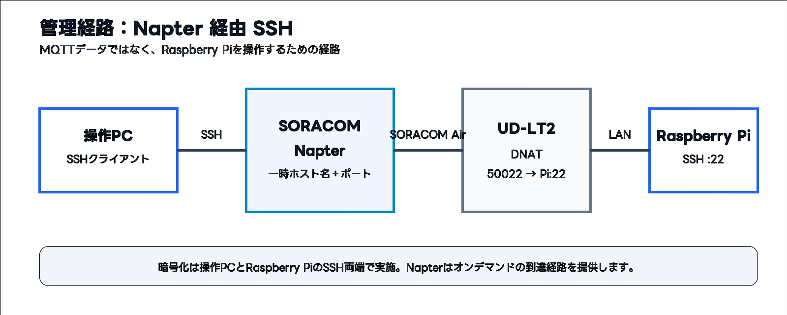
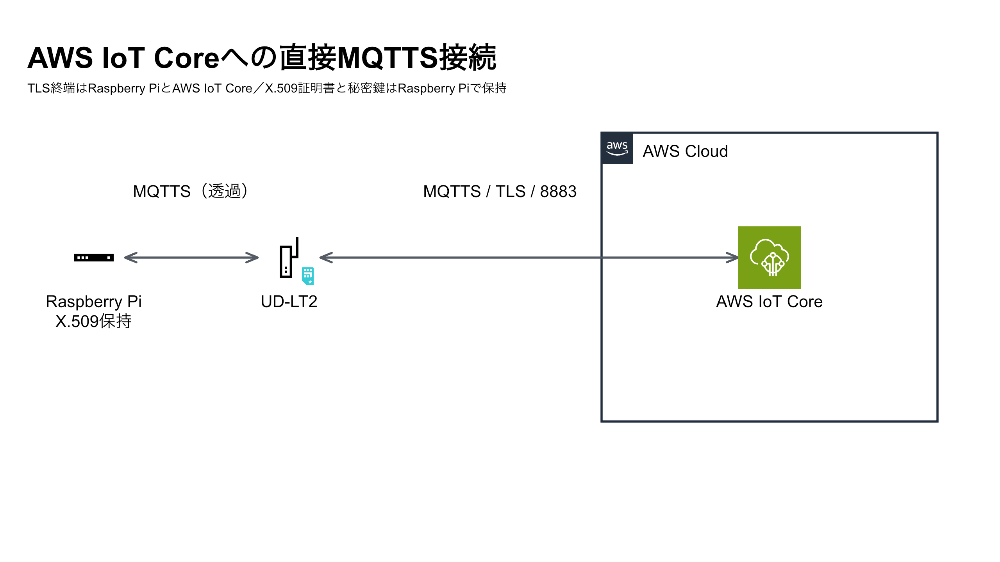
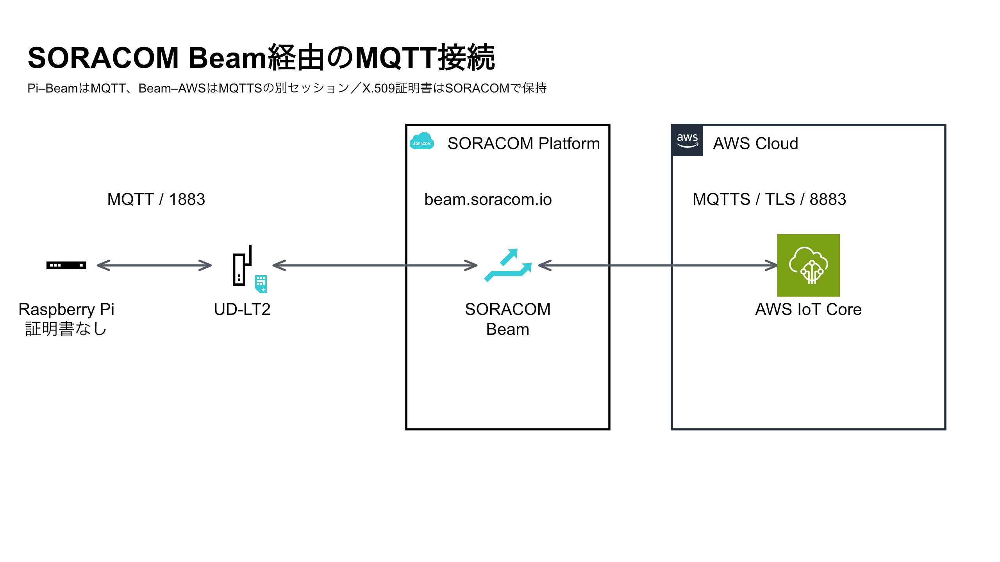

# 0. 構成を確認する

[← 前へ：概要・学習内容](overview.md) | [目次](../README.md#章一覧) | [次へ：MQTTの基本と通信レイヤー →](mqtt-basics-and-layers.md)

管理経路とデータ経路を分けて考えます。NapterはSSH操作のための管理経路です。MQTTメッセージはNapterを通りません。

構成図の編集には、[PowerPoint版（3スライド）](../diagrams/mqtt-handson-architecture.pptx)を使用してください。

## 管理経路：Napter経由SSH

操作PCからNapterの一時的なホスト名とポートへSSH接続し、UD-LT2のDNAT設定を経由してRaspberry Piの22番ポートへ到達します。暗号化はSSHの両端で行われます。

## データ経路A：AWS IoT Coreへ直結

Raspberry Piがデバイス証明書、秘密鍵、Amazon Root CA 1を保持し、AWS IoT CoreのATSエンドポイントへ8883/MQTTSで接続します。

## データ経路B：SORACOM Beam経由

Raspberry Piは証明書を指定せずbeam.soracom.io:1883へMQTT 3.1.1で接続します。BeamがSORACOM認証情報ストアの証明書を使い、AWS IoT Coreへ8883/MQTTSで接続します。

---

[← 前へ：概要・学習内容](overview.md) | [目次](../README.md#章一覧) | [次へ：MQTTの基本と通信レイヤー →](mqtt-basics-and-layers.md)
