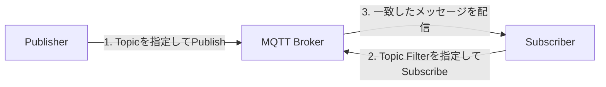

# MQTTの基本と通信レイヤー

[← 前へ：0. 構成を確認する](00-architecture.md) | [目次](../README.md#章一覧) | [次へ：1. ハンズオンを始める前に →](01-prerequisites.md)

この章では、以降のコマンドに登場するMQTTの用語と、MQTT通信を支えるネットワークのレイヤーを整理します。

## MQTTはPublish/Subscribe型の通信です

MQTTでは、クライアント同士が直接メッセージを送り合うのではなく、**ブローカー**を介して通信します。AWS IoT Coreは、このハンズオンにおけるMQTTブローカーです。



PublisherとSubscriberは固定された役割ではありません。同じMQTTクライアントが、あるトピックにはPublishし、別のトピックにはSubscribeできます。このハンズオンでは次のように使います。

| 方向 | Publisher | Topic | Subscriber |
| :---- | :---- | :---- | :---- |
| テレメトリー送信 | Raspberry Pi | `mqtt-handson/kitNN/telemetry` | 講師のAWS IoT MQTTテストクライアント |
| コマンド受信 | 講師のAWS IoT MQTTテストクライアント | `mqtt-handson/kitNN/command` | Raspberry Pi |

## 基本用語

| 用語 | 意味 | このハンズオンでの例 |
| :---- | :---- | :---- |
| MQTT Client | ブローカーへ接続し、PublishまたはSubscribeするプログラムや機器 | Raspberry Pi上の`mosquitto_pub`、`mosquitto_sub`、講師のMQTTテストクライアント |
| Broker | Publisherから受け取ったメッセージを、条件が一致するSubscriberへ配信する中継点 | AWS IoT Core。Beam方式でも最終的なブローカーはAWS IoT Core |
| Client ID | MQTT接続を識別する名前 | Thing名と同じ`mqtt-handson-kitNN`。同じIDを複数接続で同時に使わない |
| Publish | Topicを指定してブローカーへメッセージを送る操作 | Piから`telemetry`へJSONを送る |
| Subscribe | Topic Filterを登録し、一致するメッセージを受け取る操作 | Piが`command`を待ち受ける |
| Topic Name | Publish時にメッセージへ付ける宛先のような名前 | `mqtt-handson/kit01/telemetry` |
| Topic Filter | Subscribe時に受信対象を指定する条件 | `mqtt-handson/kit01/command`、講師確認用の`mqtt-handson/+/telemetry` |
| Payload | MQTTメッセージの本文。MQTT上はバイト列であり、JSONである必要はない | `{"mode":"direct","kit":"kit01","message":"hello"}` |
| QoS | MQTTメッセージの配送確認レベル | 本実習ではPublish、SubscribeともにQoS 1 |

### TopicとTopic Filter

Topicは`/`で階層のように区切りますが、ファイルシステムのディレクトリではありません。また、大文字と小文字は区別されます。

- Publishで指定するTopic Nameにはワイルドカードを使用できません。
- Subscribeで指定するTopic Filterでは、`+`が1階層、`#`が残りの全階層に一致します。
- `mqtt-handson/+/telemetry`は、`mqtt-handson/kit01/telemetry`や`mqtt-handson/kit02/telemetry`に一致します。
- `mqtt-handson/kit01/command`は、kit01のコマンドだけに一致します。

AWS IoTポリシーでは、接続、Publish、Subscribe、Receiveを別々に許可します。Topicが合っていても、Client IDやポリシーの許可範囲が異なると通信できません。

## QoSは配送確認のレベルです

MQTT 3.1.1は3段階のQoSを定義します。AWS IoT CoreがサポートするのはQoS 0と1です。

| QoS | 呼び方 | 動作 | 注意点 |
| :---: | :---- | :---- | :---- |
| 0 | At most once | 送信側はMQTTレベルの受領確認を待たない | メッセージが失われる可能性がある |
| 1 | At least once | 送信側は`PUBACK`を受け取るまで再送できる | 同じメッセージが複数回届く可能性がある |
| 2 | Exactly once | 複数段階の確認で1回の配送を実現する | AWS IoT Coreではサポートされない |

このハンズオンで`-q 1`を指定する理由は、QoS 0よりも配送確認を行いやすくするためです。ただし、QoS 1は「必ず1回だけ届く」という意味ではありません。実システムではメッセージIDをPayloadに含めるなど、受信側が重複を安全に処理できる設計が必要です。

なお、AWS IoT CoreにはMQTT仕様との差異があり、QoS 0でSubscribeした場合にも同じメッセージが複数回配信される可能性があります。QoSをメッセージ件数の絶対的な保証として扱わないでください。

Subscribe側で指定するQoSは、そのSubscriptionで受け取る最大QoSです。実際の配信QoSは、Publish時のQoSとSubscribeで許可された最大QoSのうち低い方になります。

## Retainとセッションは今回使用しません

- Retainを有効にすると、ブローカーはそのTopicの最新メッセージを保持し、新しいSubscriberへ配信できます。
- 永続セッションを使うと、切断後もSubscriptionや未確認のQoS 1メッセージを保持できる場合があります。
- 本実習のコマンドではRetainと永続セッションを使いません。Subscriberが接続していない間にPublishされたメッセージを、後から必ず受信できる実習ではありません。

## MQTT通信をレイヤーで見る

通信は、1つのプロトコルだけで動いているわけではありません。ここでは理解しやすいように、TCP/IPモデルを基準にTLSを独立して示します。

| レイヤー | 主な役割 | このハンズオンで使うもの |
| :---- | :---- | :---- |
| アプリケーションデータ | アプリケーションが扱う内容 | JSON Payload、telemetry、command |
| アプリケーションプロトコル | メッセージ交換の規則 | MQTT 3.1.1のCONNECT、PUBLISH、SUBSCRIBE、PUBACKなど |
| セキュリティ | 相手の認証、暗号化、改ざん検知 | TLS、X.509デバイス証明書、秘密鍵、ルートCA |
| トランスポート | プロセス間の接続と順序制御 | TCP。接続先の識別に1883番または8883番ポートを使用 |
| インターネット | 宛先までパケットを届ける | IP、DNS、UD-LT2のNAT |
| ネットワークアクセス | 隣接機器や通信網へデータを運ぶ | Pi―UD-LT2間のEthernet、UD-LT2―SORACOM間のLTE |

`MQTTS`はMQTTとは別のメッセージング方式ではなく、MQTTをTLSで保護して送る呼び方です。このハンズオンでは、MQTT/TCPに1883番、MQTT/TLS/TCPに8883番を使用します。

### 直結方式のレイヤー

```text
Raspberry Pi
  JSON
  MQTT 3.1.1
  TLS（Piの証明書と秘密鍵を使用）
  TCP :8883
  IP
  Ethernet → LTE
        │
        └──────── AWS IoT CoreでTLSとMQTTを終端
```

PiとAWS IoT Coreの間に、1本のMQTT over TLS接続が作られます。UD-LT2でNATされても、TLSの終端はPiとAWS IoT Coreです。Napterはこのデータ経路を通りません。

### Beam方式のレイヤー

```text
Raspberry Pi                  SORACOM Beam                     AWS IoT Core
  JSON Payload                   │                                 │
  MQTT 3.1.1                     │                                 │
  TCP :1883 ────────────────────▶│ MQTT接続を終端                  │
  TLSなし                        │                                 │
                                 │ MQTT 3.1.1 + TLS + TCP :8883 ─▶│
                                 │ SORACOM上の証明書を使用          │
                                 │ MQTTS接続を開始                  │ TLSとMQTTを終端
```

Beam方式では接続が2区間に分かれます。

1. PiからBeam：MQTT 3.1.1 / TCP / 1883。Piは証明書を使わず、この区間にTLSはありません。
2. BeamからAWS IoT Core：MQTT 3.1.1 / TLS / TCP / 8883。BeamがSORACOM認証情報ストアの証明書を使います。

PayloadとTopicはBeamを経由して転送されますが、PiからAWS IoT Coreまで一続きのTLS接続ではありません。この違いが、証明書の配置場所と運用責任の違いにつながります。

### NapterによるSSHは別の通信です

Napter経由のSSHは、Piを操作するための管理経路です。SSHはTCP上で暗号化されたセッションを作り、MQTTのTopic、Payload、QoSには関与しません。

| 用途 | アプリケーションプロトコル | TCPポート | このハンズオンでの終端 |
| :---- | :---- | :---: | :---- |
| Piの遠隔操作 | SSH | Napterの一時ポート → UD-LT2の50022 → Piの22 | 操作PCとPi |
| AWS IoT直結 | MQTT over TLS | 8883 | PiとAWS IoT Core |
| Beamのデバイス側 | MQTT | 1883 | PiとBeam |
| Beamの転送先側 | MQTT over TLS | 8883 | BeamとAWS IoT Core |

## mosquittoコマンドとの対応

| オプション | MQTTまたは通信レイヤー上の意味 |
| :---- | :---- |
| `-h` | 接続先ホスト名。DNSでIPアドレスへ解決される |
| `-p` | TCPの接続先ポート。直結は8883、Beamのデバイス側は1883 |
| `-V mqttv311` | アプリケーションプロトコルとしてMQTT 3.1.1を使用する |
| `-i` | MQTT Client ID。本実習ではThing名と同じ値 |
| `-t` | PublishのTopic NameまたはSubscribeのTopic Filter |
| `-q 1` | QoS 1を要求する |
| `-m` | PublishするPayload |
| `--cafile` | 接続先のTLSサーバー証明書を検証するルートCA |
| `--cert` / `--key` | TLSクライアント認証に使うデバイス証明書と秘密鍵 |

直結方式のコマンドにはTLS関連の3つのオプションがあります。Beam方式のPi側コマンドからはこれらがなくなり、接続先とポートが`beam.soracom.io:1883`に変わります。一方で、Topic、Payload、QoS、Client IDは同じです。

## この章の確認ポイント

- PublisherとSubscriberはブローカーを介して通信する。
- Topic NameはPublishに、Topic FilterはSubscribeに使う。
- QoS 1では重複配送が起こり得る。
- JSONはPayloadの表現方法であり、MQTTそのものではない。
- 直結方式とBeam方式では、TLSとMQTT接続の終端位置が異なる。
- NapterのSSH管理経路とMQTTデータ経路は別である。

詳細は、[OASIS MQTT Version 3.1.1仕様](https://docs.oasis-open.org/mqtt/mqtt/v3.1.1/mqtt-v3.1.1.html)、[AWS IoT CoreのMQTT](https://docs.aws.amazon.com/iot/latest/developerguide/mqtt.html)、[SORACOM Beam MQTTエントリポイント](https://users.soracom.io/ja-jp/docs/beam/mqtt/)を参照してください。

---

[← 前へ：0. 構成を確認する](00-architecture.md) | [目次](../README.md#章一覧) | [次へ：1. ハンズオンを始める前に →](01-prerequisites.md)
